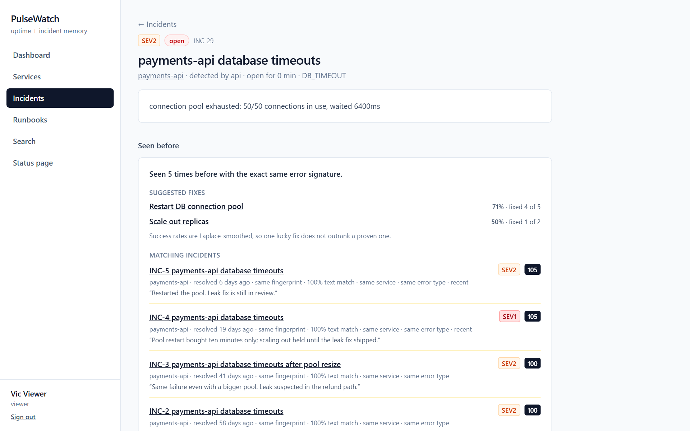
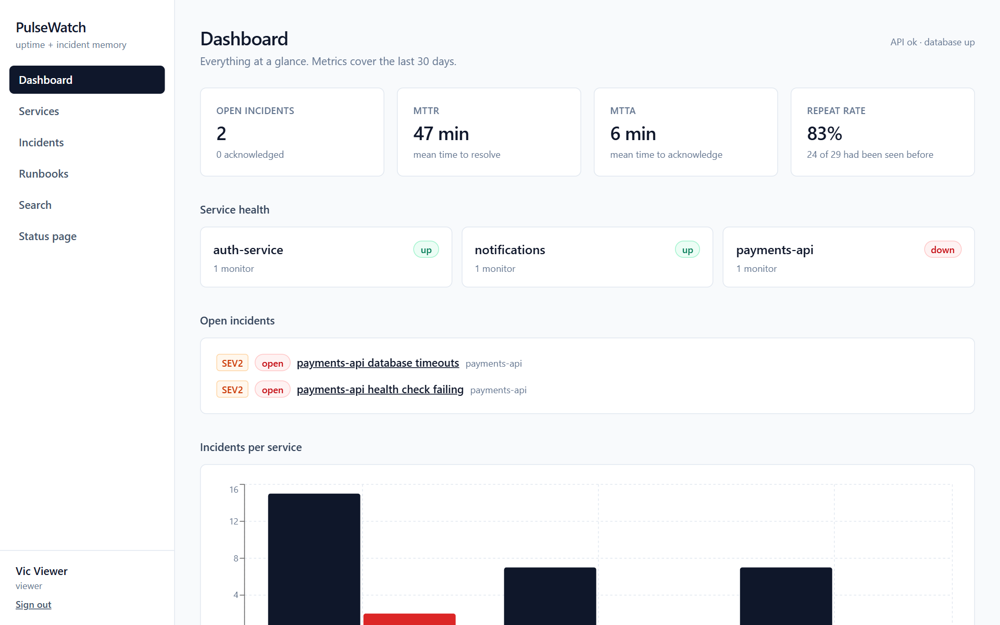
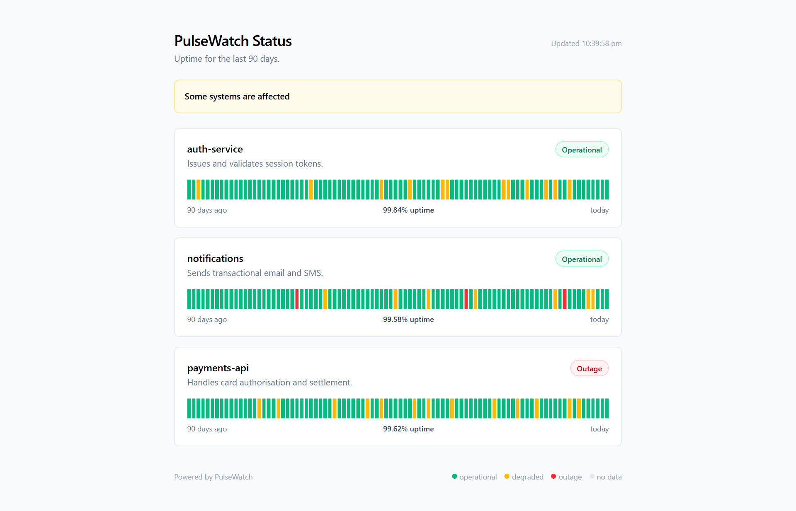
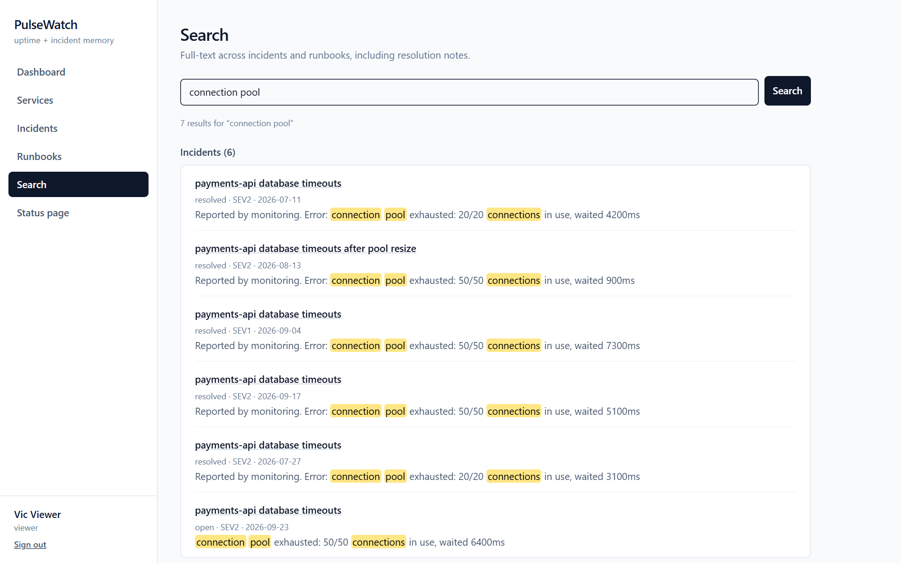
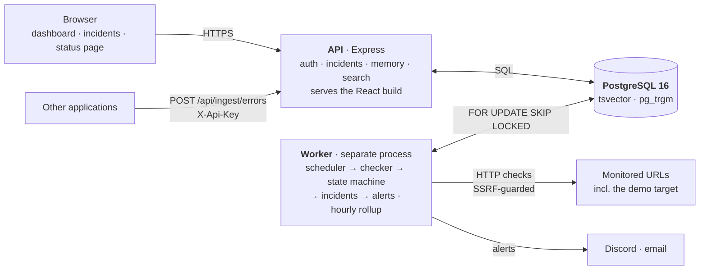

# PulseWatch

[](https://github.com/saurabh-krishnan/pulsewatch/actions/workflows/ci.yml)
-99%25-brightgreen)


**Uptime monitoring with incident memory.** PulseWatch checks your services, opens an
incident when one goes down, and tells you what fixed the same problem last time — *"Seen 5
times before. Restart DB connection pool fixed it 4 of 5 times."* It recognizes repeat
failures by fingerprinting error messages, not with an AI model, so every match comes with
the reason it matched.

**Live demo:** _link added after the first deploy — see [DEPLOY.md](DEPLOY.md)_ ·
sign in as `viewer@pulsewatch.local` / `pulsewatch123` (read-only) ·
the public [status page](#screenshots) needs no login.

## Screenshots

| An incident, recognized from history | The dashboard |
|---|---|
| [](docs/screenshots/incident-seen-before.png) | [](docs/screenshots/dashboard.png) |
| **The public status page** | **Full-text search** |
| [](docs/screenshots/status-page.png) | [](docs/screenshots/search.png) |

Screenshots are generated from the production build by `scripts/screenshots.ts`.

## What it does

- **Monitors** HTTP endpoints on a schedule, with failure and recovery thresholds so one slow
  response does not page anyone at 3 a.m.
- **Opens an incident automatically** when a monitor goes down, with a timeline that records
  every alert, acknowledgement, comment, runbook tried and resolution — and resolves it
  automatically on recovery.
- **Remembers**: fingerprints each error, finds past incidents with the same signature or
  similar text, and ranks the runbooks that actually fixed them.
- **Alerts** on Discord and email, and never lets a failed alert stop the monitoring.
- **Ingests** errors from other applications over an API key, deduplicating repeats.
- **Reports**: MTTR, MTTA, repeat rate, a public 90-day status page, and a postmortem
  drafted from the timeline.

## Architecture



The worker is a **separate process** from the API: checking hundreds of URLs is background
work, and a slow batch must never delay an API request. They share only the database. The
worker claims due monitors with `FOR UPDATE SKIP LOCKED`, so a second worker process never
checks the same monitor twice — `npm run verify:skip-locked` proves it.

## How incident memory works

Two errors from the same underlying problem rarely look identical:

```
2026-09-21T10:15:32Z ERROR Timeout after 5000ms connecting to 10.0.3.17:5432 (request 8f14e45f-ceea-467f-a4a0-3b2f1c6a9d10)
2026-09-24T03:01:09Z ERROR Timeout after 3000ms connecting to 10.0.3.22:5432 (request 1b4e28ba-2fa1-11d2-883f-0016d3cca427)
```

Normalization replaces the variable parts, in a deliberate order — UUIDs, timestamps, URLs,
emails and IPs before bare numbers, because once `\d+` has run a UUID is unrecoverable.
Both messages become:

```
<ts> error timeout after <num>ms connecting to <ip>:<num> (request <uuid>)
```

That string is hashed with SHA-256 together with the error type. Same hash, same problem.
In the seed data, **27 historical incidents collapse into 12 fingerprints**.

A new incident is then ranked against past resolved ones:

| Signal | Points |
|---|---|
| Same fingerprint | 50 |
| Text similarity (`pg_trgm`, 0–1) | up to 25 |
| Same service | 15 |
| Same error type | 10 |
| Shares a tag | 5 |
| Resolved in the last 30 days | 5 |

Anything scoring 30 or more surfaces, top 5, each with the reason it matched. Candidate
selection happens in SQL; the scoring runs in TypeScript so it can be unit-tested without a
database.

Finally, the runbooks that fixed those incidents are ranked by a Laplace-smoothed success
rate, `(worked + 1) / (tried + 2)`, so a runbook that worked 1 of 1 does not outrank one
that worked 9 of 10. Every match is explainable, because nothing here is a model.

## Tech stack

| Layer | Choice |
|---|---|
| Frontend | React 19, Vite, TypeScript, Tailwind CSS, React Router, TanStack Query, Recharts |
| Backend | Node.js, Express, TypeScript, Zod |
| Database | PostgreSQL 16 with full-text search (`tsvector`) and `pg_trgm`; Prisma |
| Auth | bcrypt, JWT, role-based access (admin · engineer · viewer), hashed API keys |
| Testing | Vitest, Supertest against a real Postgres, Playwright |
| Delivery | esbuild bundles, multi-stage Docker images, GitHub Actions, Render |

## Run it locally

Needs Node 20+ and PostgreSQL 16 (Docker, or a local install — see [SETUP.md](SETUP.md)).

```bash
cp .env.example .env
npm install
npm run db:up             # Postgres on :5432 via Docker; or `npm run pg:start` without Docker
npm run db:migrate
npm run db:seed           # demo accounts, services, runbooks and 90 days of history
npm run dev               # api :4000 · web :5173 · worker · demo target :4100
```

Open <http://localhost:5173>. Locally every seeded account uses the password `pulsewatch123`:

| Email | Role | Can |
|---|---|---|
| `admin@pulsewatch.local` | admin | everything, including services, monitors and API keys |
| `engineer@pulsewatch.local` | engineer | open, acknowledge and resolve incidents; write runbooks |
| `viewer@pulsewatch.local` | viewer | read only |

To watch the whole loop, break the demo target and wait for the incident:

```bash
curl -X POST http://localhost:4100/mode -H "content-type: application/json" -d "{\"mode\":\"failing\"}"
```

Modes are `healthy`, `slow` (8s, so it times out) and `failing` (HTTP 503).

### Configuration

Everything lives in one root `.env`; `.env.example` documents each setting. The ones that
matter most:

| Variable | Purpose |
|---|---|
| `DATABASE_URL` | Postgres connection string |
| `JWT_SECRET` | Token signing key. Production refuses a placeholder or anything under 32 characters |
| `ALLOW_PRIVATE_MONITOR_TARGETS` | `true` locally so monitors can reach the demo target. Production refuses to start with it on |
| `MONITOR_HOST_ALLOWLIST` | Specific private hosts monitors may reach anyway, e.g. an internal demo target |
| `DISCORD_WEBHOOK_URL`, `SMTP_URL`, `ALERT_EMAIL_TO` | Optional alert channels |
| `WEB_DIST_DIR` | When set, the API serves the built web app (production) |
| `TRUST_PROXY` | Proxy hops in front of the API, so rate limits see real client IPs |
| `DEMO_ADMIN_PASSWORD` | Production only: the admin and engineer demo accounts' password |

## Testing

| Suite | What it covers | Command |
|---|---|---|
| Unit | fingerprinting, state machine, scoring, postmortems, SSRF rules, schemas; the checker against a real local HTTP server | `npm run test:unit` |
| API | Supertest against a real Postgres: auth, roles, the incident lifecycle, incident memory, ingest dedup, SSRF, headers, CORS, rate limits | `npm run test:api` |
| E2E | Playwright against a full separate stack: log in → create a monitor → break the target → the worker opens an incident → acknowledge → resolve | `npm run test:e2e` |

`npm test` runs unit and API together; add `-- --coverage` for the coverage report
(thresholds: 90% lines/functions/statements, 85% branches on `packages/shared`).

The API and E2E suites use the `pulsewatch_test` database and **truncate every table**, so
they refuse to run against any database whose name does not end in `_test`. E2E starts its
own stack on ports 4010/4110/5183, so it does not disturb a dev stack.

CI runs all three on every push, then builds the production Docker images and smoke-tests
them, and deploys only when everything has passed.

## Security

- **SSRF protection** on monitor URLs: private, loopback, link-local (including cloud
  metadata at `169.254.169.254`), CGNAT, multicast and reserved addresses are refused, in
  IPv4 and IPv6, including encodings such as `http://2130706433/` and
  `http://[::ffff:169.254.169.254]/`. Enforced when a monitor is saved, again before each
  check, and at connect time through a guarded DNS lookup, which also defeats DNS rebinding.
  Redirects are never followed.
- **Authentication:** bcrypt password hashes, one-hour JWTs, identical responses *and*
  identical bcrypt work for unknown emails and wrong passwords, rate-limited login and sign-up.
- **API keys** stored as SHA-256 hashes, shown once, revocable; ingest rate-limited per key.
- **Transport:** Helmet security headers; CORS restricted to the configured frontend.
- **Input:** Zod validation on every body; parameterized SQL only; malformed JSON and
  oversized bodies return 4xx, never 500.
- **Production guards:** refuses to start with a placeholder `JWT_SECRET` or with private
  monitor targets enabled; the public demo's admin password is never the published one.

## Deploying

The free path is Render for the app and Supabase for Postgres, set up from the included
`render.yaml` Blueprint. [DEPLOY.md](DEPLOY.md) walks through it, including the trade-offs
of the free tier. The same images run anywhere with Docker:

```bash
JWT_SECRET=... DEMO_ADMIN_PASSWORD=... docker compose -f docker-compose.prod.yml up -d --build
```

After a deploy, `BASE_URL=https://your-app scripts/smoke-test.sh` checks it the way a visitor
would.

## More detail

- **Status page** — `/status` is public and exposes only names, status and daily uptime. It
  reads the `uptime_daily` rollup, so 90 days costs 90 small rows per monitor instead of
  scanning ~130,000 raw checks. `npm run rollup -w @pulsewatch/worker` runs the rollup on demand.
- **Postmortems** — `GET /api/incidents/:id/postmortem` drafts Markdown from the timeline and
  leaves root cause and action items blank on purpose.
- **Alerting without Discord** — set `DISCORD_WEBHOOK_URL=http://localhost:4100/webhook` and
  read what was sent from `GET http://localhost:4100/webhook`.
- **Ingest** — create an API key on a service page, then `POST /api/ingest/errors` with
  `X-Api-Key`. A repeat of the same underlying error attaches to the open incident.
- **[DECISIONS.md](DECISIONS.md)** — why things are the way they are, phase by phase,
  including the bugs found along the way.

## Future work

- On-call schedules with escalation when an alert is not acknowledged in time
- Multi-region checks that mark a service down only when two regions agree
- TLS certificate expiry checks
- Maintenance windows that silence alerts during planned work
- Live dashboard updates over Server-Sent Events
- Teams and organizations (multi-tenancy)
